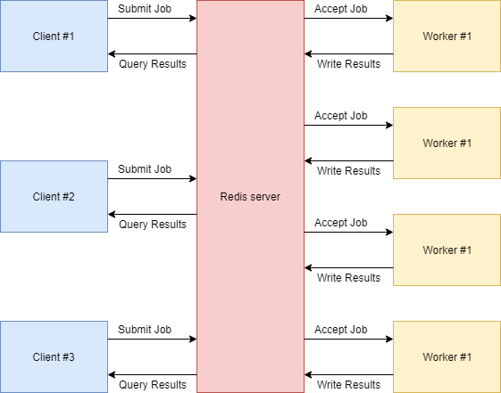

# GearMonkey

GearMonkey is a simple protocol for implementing an asynchonous job queue in Redis. It allows you to execute multiple
tasks in parallel, across different servers and even different languages. GearMonkey's goal is to lay the groundwork
for a reliable, distributed Microservice architecture without the common overhead of binding services to HTTP servers.  

## Disclaimer

The key words "MUST", "MUST NOT", "REQUIRED", "SHALL", "SHALL NOT", "SHOULD", "SHOULD NOT", "RECOMMENDED", "MAY", and
"OPTIONAL" in this document are to be interpreted as described in [RFC 2119](https://tools.ietf.org/html/rfc2119).

Because GearMonkey is a protocol, and not a library, this specification does not aim to define a public interface
for consumers. While the internals of a GearMonkey implementation MUST follow the specifications outlined in this
document, the externals, such as class / function names, parameter definitions, etc, MAY differ greatly.

## Specification

The GearMonkey architecture consists of three parts: _Servers_, _Clients_, and _Workers_. These entities work with
small, structured sets of data called _Jobs_.

* A _Job_ is a task or unit of work that a Client chooses to offload to a Worker process. 
  A job has a name (referred to as the _Function_), and usually a payload consisting of one or more parameters,
  referred to as the _Input_.
* A _Server_ is a running Redis instance where requested jobs will be stored.
* A _Client_ is a process that submits a job request to the server, and optionally
  monitors its status to completion.
* A _Worker_ is a process that polls for queued jobs, attempts to complete them,
  and submits the result (or an error raised during job execution) back to the server.
  


**What should be considered a job?**

A Job can be _anything_. Even the most basic function calls can be processed as a job
through GearMonkey workers. However, two main factors help decide which tasks should be run as GearMonkey jobs:

1. The client lacks the tools or resources to execute the function internally; or
2. The function should be run asynchronously in order to optimize efficiency and end-user experience.

Some good examples: HTTP API calls, heavy database queries, graph/tree search algorithms.

**Variable placeholders**

Throughout this specification, the following placeholders will be used to reference
values known only at runtime. Logically, implementations must substitute these placeholders
with their actual values.

* `{FN}` : A job's function name. (String)
* `{ID}` : A generated job ID. (Integer)
* `{PRIO}` : The job priority as set by the client. (String: [ low | normal | high | scheduled ])
* `{OPTIONS}` : A set of 0 or more options that influence the client's behaviour.
  We currently define two options:
  * `OPT_BLOCKING` instructs the client to block further code execution until the job
    has been finished either successfully or with raised errors, effectively making the
    call synchronous.
  * `OPT_ROLLCALL` instructs the client to 'Roll Call' prior to job creation, and check
    if any workers are currently registered with the server.
* `{INPUT}` : The job's payload (String)
* `{OUTPUT}` : The finished job's return value (String)
* `{TIMEOUT}` : The timeout (in seconds) for blocking calls as set by the client. (Integer)
* `{SYSTEM_DATE}` : The current UNIX timestamp (Integer)
* `{SCHEDULED}` : The UNIX timestamp (in seconds) the job is scheduled for.
  Scheduled jobs become eligible for execution when `{SCHEDULED} <= {SYSTEM_DATE}`.

### Client

#### Interface

In order to serve as a GearMonkey Client, a library must expose two methods to
userspace:

**`Client.run( {FN} , {INPUT} , {PRIO} , {OPTIONS}, {TIMEOUT}/{SCHEDULED} ) ==> {ID}`**

Instruct the client to connect to the server, and deliver the job.
The client must be able to poll the job status afterwards, which means the method must
store or return the generated `{ID}` that the server responds with. If the server does
_not_ respond with a job ID, job creation must be assumed to have failed.

* The default priority is **normal**, and can be overridden in the method call.
* The default options set is empty, and can be overridden with any combination of the
  options mentioned above. The client implementation must honor these options, and
  change strategy accordingly.
  * On `OPT_BLOCKING`, the client must block further execution, and only return when
    the worker has finished execution and communicated the status back to the server.
    Note that this does not imply a successful execution: A job is also considered
    'finished' if execution is cancelled or interrupted due to raised errors.
  * On `OPT_ROLLCALL`, the client must perform a 'Roll Call' where it queries the number
    of workers currently registered for the specified function `{FN}`. If this query
    returns 0 or any non-integer value, the client must raise an error in userspace.
    A Roll Call does not imply that the job will be finished, or even started, quickly.
    Also, it does not imply atomicity, meaning that any number of workers can die off
    between the Roll Call and the actual job creation.

**`Client.get( {FN} , {ID} )`**

Instruct the client to return structured data that describes the current state of the job.
This data must include at least the output (`{OUTPUT}`) and the status (`{STATUS}`).
This data can be requested from the server in realtime, or can be preset by `Client.run`
in blocking mode.

#### Implementation

```
// Creating and inserting a new job:
// ---------------------------------

// (OPT_ROLLCALL only) Count registered workers. Raise an error when the result does not >= 1
GET count:{FN}

// Generate a job ID
INCR uid:{FN}

// Insert the job into a Redis hashmap.
HMSET job:{FN}:{ID} status "idle" input "{INPUT}"

// Publish a created event to the channel.
PUBLISH channel:{FN} "create:{ID}"

// Insert the job ID into the queue.
ZADD queue:{FN}:{PRIO} {SCHEDULED} {ID} // when {PRIO} == 'scheduled'
LPUSH queue:{FN}:{PRIO} {ID} // when {PRIO} != 'scheduled'

// (OPT_BLOCKING only) Run a blocking Pop call on a custom list.
BRPOP lock:{FN}:{ID} {TIMEOUT}

// Redis must now return {ID} back to the client,
// if it hasn't yet done so with the INCR call.

// Fetching job data:
// ------------------

// Client.get will always return the full job hash
HGETALLL job:{FN}:{ID}
```

### Worker

#### Interface

In order to serve as a GearMonkey Worker, a library must expose two methods to userspace,
but is encouraged to include a third one:

**`Worker.accept( {FN} )`**

Instruct the worker to accept jobs within the specified function. A worker *may* accept
multiple functions, and so must accept multiple calls to `Worker.accept`, although using
this feature would considered a bad practice in _most_ cases.

**`Worker.work( {INPUT} )`**

A worker must require userspace to implement a 'working' function that the worker will
call when it receives a job payload. This custom function must return a value on success,
or raise an error if it can not successfully complete. The worker will base the `{STATUS}`
on the result value of this function, and will set it to either "**success**" or "**error**".

**`Worker.update( {DIVIDEND} , {DIVISOR} )`**

This function is optional, but recommended for workers (and clients) often processing
jobs with a runtime of more than a few seconds. By calling this method from inside the
working code, a worker may notify clients whenever a job is partially completed.
It does so by sending the Dividend (indicating the currently completed part)
and the Divisor (the total workload) to the server. Non-blocking clients can poll
these values to calculate the overall progress.

#### Implementation

```
// On worker start:
// ----------------

SCRIPT LOAD "local item = redis.call('ZRANGEBYSCORE', KEYS[1], 0, ARGV[1], 'LIMIT', 0, 1); if (#item > 0) then redis.call('ZREM', KEYS[1], item[1]); return { KEYS[1],  item[1] }; end"
INCR count:{FN}

// Main worker loop:
// -----------------

// Run these in an endless loop; only run BRPOP if EVALSHA returns a nil value.
// NOTE: Always check if the sha1 hash matches SCRIPT LOAD's output value.
EVALSHA 5231827cd49b540660ef44969b38cc858f157824 1 queue:{FN}:scheduled {SYSTEM_DATE}
BRPOP queue:{FN}:high queue:{FN}:normal queue:{FN}:low 1

// On recieving a job:
// -------------------

// Publish a 'start' event
PUBLISH channel:{FN} "start:{ID}"

// Update the job status
HMSET job:{FN}:{ID} status "busy"

// Sending intermediate status updates:
// ------------------------------------

HMSET job:{FN}:{ID} status:dividend "{DIVIDEND}" status:divisor "{DIVISOR}"

// On completing a job:
// --------------------

// Update the job hash
HMSET job:{FN}:{ID} status "{STATUS}" output "{OUTPUT}"

// Set the hash to expire in 25 hours
EXPIRE job:{FN}:{ID} 90000

// Publish a 'finish' event
PUBLISH channel:{FN} "finish:{ID}"

// Push to the lock list (to finish any blocking calls) with an expire of 10 seconds
LPUSH lock:{FN}:{ID} "OK"
EXPIRE lock:{FN}:{ID} 10

// On worker exit:
// ---------------

DECR count:{FN}
```